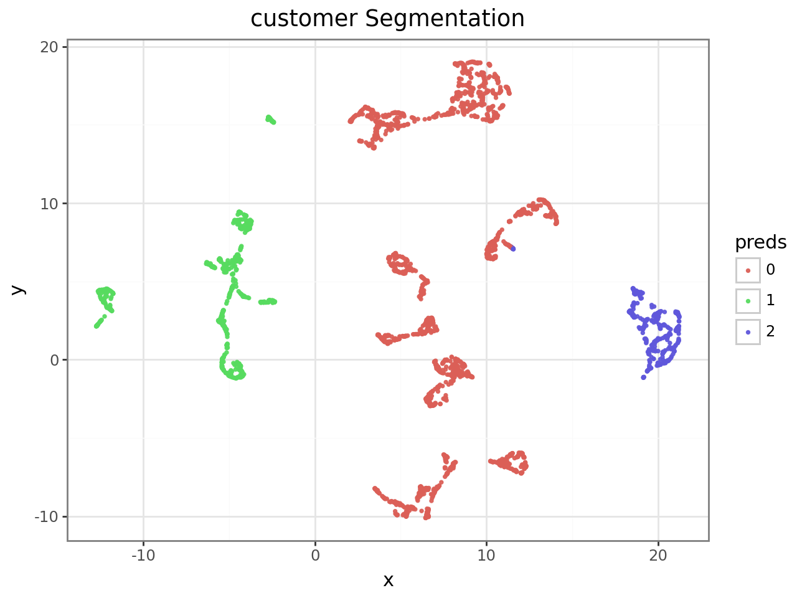
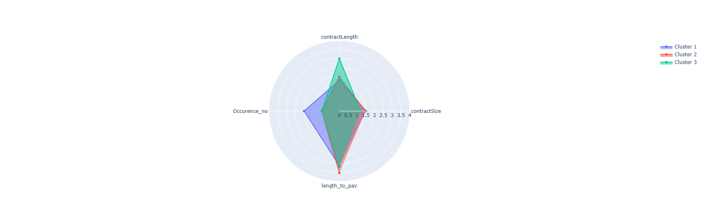

# Customer Churn Prediction & Segmentation

# Introduction
This repository contains a complete, end-to-end machine learning workflow for identifying customer churn risk and segmenting customers into actionable groups. The project integrates both supervised and unsupervised learning methods to mirror real-world business scenarios where churn labels are often unavailable and must be deduced from contract behavior. It covers data cleaning, exploratory data analysis, feature engineering, churn label derivation, supervised modeling (Logistic Regression and Random Forest), clustering using Gower distance and K-Medoids, dimensionality reduction with UMAP, cluster interpretation, and customer prioritization. The final output ranks customers based on their likelihood to churn and their behavioral segment.

# Dataset
Source: Kaggle – Customer Churn Data  
https://www.kaggle.com/datasets/kagglemaster95/customer-churn-data

Files referenced:
- accounts.csv
- contracts.csv

## Repository Structure
```

├── README.md
├── modeling_notebook.ipynb
├── requirements.txt
```
# Project Objective
The goal of this project is to identify customers who are likely to churn between Q3 and Q4 of 2021, using only the limited information provided in the dataset. The dataset contains fields such as contract start date, contract value, expiry date, and region, but it does not include an explicit churn label. Therefore, churn must be derived from contract lifecycle patterns. Once churn probabilities are computed, customers are ranked using a combination of churn likelihood and behavioral segments.

# Data Exploration and Cleaning
The ContractID column is a composite key consisting of VendorID, AccountID, and an Occurrence number (contract count for the account). This was decomposed for better analysis.

Column definitions:
- closingDate: When the contract was finalized
- contractsize: Monetary value of contract
- ContractLength: Duration in years
- PaymentDate: When customer paid
- ContractID: Composite key
- AccountID: Customer ID
- Region: Geographic region
- PartnerInvolved: Yes/No

# Summary of Data Insights & Feature Derivation
- Contract Expiry Date = closingDate + ContractLength
- Only contracts expiring between Q3–Q4 2021 are in scope
- PaymentDate nulls belong only to out-of-scope rows
- length_to_pay = PaymentDate – closingDate

# Deriving the Target Label (Churn)
Churn was derived using contract timelines:

- Renewed → Customer signs a new contract on or 1 day before expiry  
- Churned → Contract expired before June 30 2021, no renewal  
- Unknown → Expiry after June 30 2021 (no future data)

This accurately simulates real business inference when labels are not provided.

# Supervised Learning

### Dataset Splits
- Training Set: closingDate ≤ June 30 2021  
- Prediction Set: expiry in Q3–Q4 2021  
- Out-of-scope: expiry after Q4 2021  

### Models
**Logistic Regression (baseline):**
- One-hot encoded inputs  
- Good interpretability  
- Used for final predictions  

**Random Forest:**
- Underperformed baseline due to small dataset and limited features  

# Unsupervised Learning

Supervised learning tells us WHO will churn.  
Unsupervised learning tells us HOW TO ACT on them.

### Gower Distance
Used for mixed numeric & categorical features:
- contractsize
- ContractLength
- Occurrence
- length_to_pay
- PartnerInvolved

Excluded: region, quarter

### Clustering Methods
- K-Medoids → Best silhouette score  
- Agglomerative → Weaker separation  

### Silhouette Score
- 1 = strong clusters  
- 0 = overlapping  
- -1 = misclustered  

### Optimal Clusters
- Elbow: 5  
- Business simplicity: **3 clusters used**

### UMAP Visualization
UMAP was applied to the Gower matrix to show clusters in 2D space.



# Clustering Insights

### Cluster 1 – High Value / High Renewal
- High contract size  
- Frequent renewals  
- Long-term  
**Highest priority**

### Cluster 3 – Long-Term / Low Value
- Highest contract length  
- Lowest occurrence  
**Second priority**

### Cluster 2 – Low Engagement / Slow Payment
- Lowest renewal occurrence  
- Largest payment delays  
**Lowest priority**

### Cluster Priority
**C1 → C3 → C2**



# Conclusion
This project demonstrates an end-to-end workflow combining supervised and unsupervised learning for actionable churn detection. Churn labels were derived logically from contract behavior, simulating realistic business conditions. By combining churn probability and behavioral clustering, the business gains a powerful, actionable prioritization system.

Future improvements:
- Advanced models (XGBoost, CatBoost)
- More feature engineering
- Cluster stability analysis
- Real-time prediction pipeline
